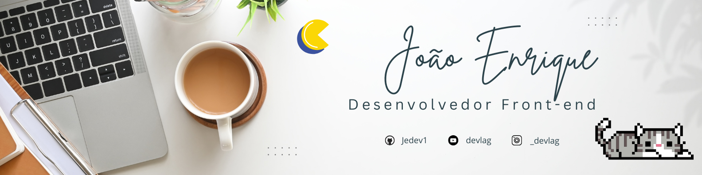

 
<h1 align="center">Opa e aí, tudo bem?</h1>

Meu nome é João, sou um desenvolvedor web, de jogos e aplicativos possuo muitos conhecimentos na área de tecnologia pois gosto muito da área e invisto bastante em mim mesmo nessa área e acredito que dentro do meu github possuo projetos que mostrem minha habilidade e competência

<h1 align="center">💻 Tecnologias e Ferramentas</h1>

  
Linguagens: HTML5, CSS3, JavaScript, Python, GDscript
 
  
Frameworks: React.js, flet

  
Ferramentas: Git, Visual Studio Code, Godot

 

  

<h1 align="center">🕹️ Projetos de Jogos</h1>

Operação hut-9: <a href="https://github.com/Jedev1/Operacao-hut-9" align="center">Confira o projeto aqui</a>

<h1 align="center">🚀 Projetos Front-end</h1>

Portifolio: <a href="https://jedev1.github.io/Meu-portifolio/" align="center">Confira o projeto aqui</a>

Link para redes sociais: <a href="https://jedev1.github.io/Social-link-perfil/">Confira o projeto aqui</a>

<h1 align="center">📚 Educação</h1>

IFMA campus Açailândia - Informatica

<h1 align="center">🌐 Onde me encontrar</h1>

Estou aberto a propostas dentro das minhas redes sociais

<ul align="center">
  

</ul>

<h1 align="center">😎 Status</h1>

